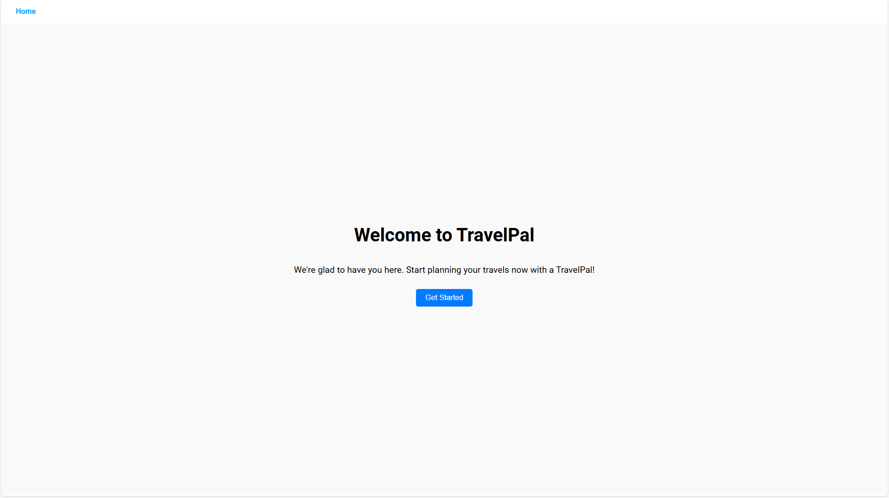
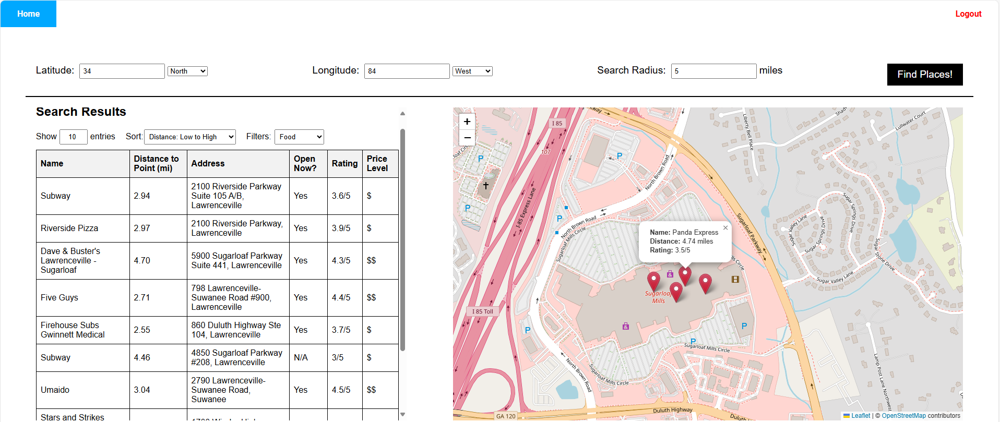

# TravelPal

**TravelPal** is a web application that helps users explore nearby locations based on latitude and longitude. It features various filters such as food, entertainment, and more, allowing users to find exactly what they are looking for. The project utilizes a React frontend and a Spring Boot backend, and it integrates with the Google Maps API to fetch and display location data.

**Welcome Screen**

**Main Screen**

## Release 1.1
The current release of **TravelPal** includes the following features:
- **Search by Location**: Enter latitude and longitude to get a list of nearby places.
- **Filter by Category**: Narrow down results using filters like food, entertainment, etc.
- **Google Maps Integration**: Leverages the Google Maps API to get real-time location data.
- **Responsive UI**: The interface adapts to different screen sizes, providing a seamless experience on any device.
### Bug Fixes and Improvements
- Changed coordinate system to improve reliability and reduce user error
- Split backend and frontend to improve modularity
- Updated packages used and fixed an issue with the open feature
### Known Issues
- Login may fail (Check troubleshooting)

## Future Plans
- **User Caching**: Implement user history for personalized requests
- **Advanced Filters**: Add more specific filters such as price range, ratings.
- **Location Sharing**: Allow users to share their current location with friends.
- **Dynamic Location Update**: Update location and pins based on central location on map
---

## Setup & Installation

### Prerequisites
Ensure you have the following installed on your system:
- **Node.js** (version 20 or higher)
- **npm** (version 10 or higher)
- **Java** (version 17 or higher)
- **Maven** (version 3.6 or higher)
- **Google Maps API key** (from [Google Cloud Platform](https://cloud.google.com/maps-platform/))

### Installation Instructions

#### Frontend (React)

1. Clone the repository (Or install from Releases and unzip):
    ```bash
    git clone https://github.com/rmmhm/TravelPal.git
    cd TravelPal/app
    ```

2. Install the necessary dependencies:
    ```bash
    npm install
    ```

3. If running locally, create a `.env` file in the frontend directory and add the following. This will connect the backend to the frontend
    ```
    REACT_APP_SERVER_URL=http://localhost:8080
    ```

4. Start the React development server:
    ```bash
    npm start
    ```

#### Backend (Spring Boot)

1. Navigate to the root project directory:
    ```bash
    cd TravelPal/TravelPal
    ```

2. Install backend dependencies and compile the project:
    ```bash
    mvn clean install
    ```

3. Run the Spring Boot application:
    ```bash
    mvn spring-boot:run
    ```

---

## Running the Application

1. Ensure the backend is running:
    ```bash
    cd backend
    mvn spring-boot:run
    ```

2. Start the React frontend in another terminal:
    ```bash
    cd frontend
    npm start
    ```

3. Access the application by visiting `http://localhost:3000`.
4. Create an account and login to access the core service

---

## Troubleshooting

During installation, you might encounter the following common issues:

### 1. **npm: Command Not Found**
   **Cause**: Node.js is not installed or not added to your system's PATH.
   **Fix**:
   - Ensure Node.js is installed. You can check by running `node -v` in your terminal.
   - If Node.js is installed but `npm` isn't found, ensure your Node.js directory is in the system's PATH.
   - For Windows, reinstall Node.js and select the option to add it to the PATH.
   - For MacOS/Linux, try restarting your terminal after installation or manually adding Node.js to your PATH.
   - If using fnm ensure that fnm is initialized on terminal startup or run (Powershell only):

   ```bash
        fnm env --use-on-cd | Out-String | Invoke-Expression
   ```

### 2. **mvn: Command Not Found**
   **Cause**: Maven is not installed or not added to your system's PATH.
   **Fix**:
   - Ensure Maven is installed. You can check by running `mvn -v`.
   - Add Maven to your system’s PATH if it's not there. Refer to [this guide](https://maven.apache.org/install.html) for instructions.

### 3. **Unable to login (locally)**
   **Cause**: .env file is not set 
   **Fix**:
   - Make sure you added the port to  `.env` file in the frontend directory as:
     ```
     REACT_APP_SERVER_URL=http://localhost:8080
     ```

### 5. **Backend Fails to Start**
   **Cause**: Missing or incorrect Java version, or a Maven build failure.
   **Fix**:
   - Ensure Java 17 or higher is installed (`java -version`).
   - Check for errors during the `mvn clean install` step and resolve them based on the logs.
   - Verify that no other service is using the backend port (default: 8080).

---

Feel free to contribute to the project or submit any issues you encounter!